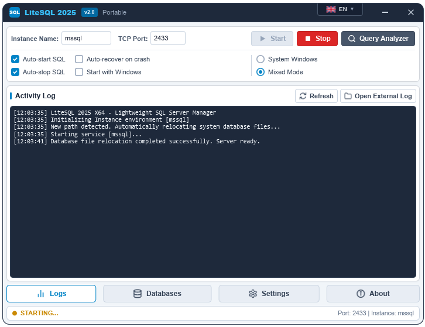

# LiteSQL 2025 - Portable SQL Server Manager

<p align="center">
  
</p>

<p align="center">
  
  
  
  
  
  
</p>

---

## 🌟 Overview / Giới thiệu

**LiteSQL 2025** is an ultra-lightweight, high-performance, fully portable management tool and runtime launcher for **Microsoft SQL Server** (supporting versions from **2014 up to 2025 Express / Enterprise**). 

Built with **Rust** and **Slint GUI**, LiteSQL enables instant SQL Server deployment without the bloat and complexity of the standard Windows installer. Simply unzip, double-click, and run SQL Server anywhere (USB drives, portable folders, development workstations, or cloud VPS servers).

> **LiteSQL 2025** là công cụ quản lý và khởi chạy Microsoft SQL Server siêu nhẹ, hoàn toàn Portable (không cần cài đặt rườm rà), được viết bằng **Rust** và giao diện **Slint**. Hỗ trợ từ SQL Server 2014 đến 2025, khởi động chỉ với 1 cú click chuột.

---

## ✨ Key Features / Tính năng nổi bật

- 🚀 **100% Portable & Zero Installation**: No MSI installers, no registry leftovers, no background services permanently running when closed.
- 🔄 **Smart Auto-Relocation**: Moving the folder to a different path or drive? LiteSQL automatically detects directory changes and relocates all system databases (`master`, `model`, `msdb`, `tempdb`) using minimal maintenance mode before launching.
- 🛡️ **Windows Server 2012/2016/2019/2022 Ready**:
  - Full compatibility with strict security policies on Windows Server editions.
  - Automatic Inbound **Windows Firewall** management via `netsh` (automatically opens ports & engine binary).
  - Safe self-signed TLS generation to prevent RDP certificate conflicts (`TDSSNIClient 0x80092004`).
  - Automatic `CHECK_POLICY = OFF` handling for development passwords (e.g. `123456`) under Windows Server Password Complexity Policies.
- 🔌 **Full DBNETLIB / OLE DB / ODBC Client Compatibility**:
  - Automatically configures client TCP aliases (`ConnectTo`) across **HKCU**, **HKLM (64-bit)**, and **WOW6432Node (32-bit)**.
  - Resolves `.`, `(local)`, `localhost`, `127.0.0.1`, `<InstanceName>` to active TCP ports for legacy 32-bit clients (`isqlw.exe`, Query Analyzer 2000, game servers like Mu Online, VB6/ASP apps).
  - Configures ODBC Drivers and System DSNs for instant connection via SSMS, Navicat, Excel, and Access.
- 🗄️ **Built-in Database Management**:
  - Real-time database list with size (MB), status (`ONLINE`/`OFFLINE`), and file paths.
  - **Create Database**: Specify names and custom storage paths.
  - **Attach Database**: Fast attachment with single MDF or MDF+LDF pairs.
  - **Detach / Drop Database**: Safe detachment or forced single-user deletion.
  - **Rename Database**: Immediate T-SQL rename with connection resets.
  - **Backup & Restore (.BAK)**: Full database backups and smart RESTORE with automatic logical file relocation (`RESTORE FILELISTONLY` -> `MOVE`).
- ⚡ **Memory Cap Control**: Dynamic buffer pool memory limitation (`sp_configure 'max server memory (MB)'`).
- 🛠️ **One-Click Query Analyzer (`isqlw`)**: Automatically downloads and launches the classic SQL Server Query Analyzer with automatic SA authentication.
- 🌐 **Multi-Language Support**: English, Tiếng Việt (Vietnamese), and 简体中文 (Simplified Chinese) loaded dynamically via Lua bundles (`plugin/i18n.lua`).
- 📥 **Plugin Extensibility**: SQL Server version mirrors and download links easily managed through `plugin/download.lua`.

---

## 🖥️ Screenshots / Giao diện

<p align="center">
  
  <br>
  <em>LiteSQL 2025 Running on Windows - Activity Log & Real-Time Status</em>
</p>

---

## 📥 Quick Start / Hướng dẫn sử dụng

### 1. Requirements / Yêu cầu hệ thống
- **OS**: Windows 10, Windows 11, Windows Server 2012 / 2012 R2 / 2016 / 2019 / 2022 (x64).
- **Permissions**: Run as **Administrator** (required to configure SQL Server network ports, aliases, and registry parameters).

### 2. Running LiteSQL / Khởi chạy
1. Extract the `LiteSQL2025` folder to any directory (e.g., `D:\LiteSQL2025`).
2. Right-click `LiteSQL.exe` -> **Run as Administrator**.
3. Choose your desired:
   - **Instance Name**: Default is `mssql`.
   - **TCP Port**: Default is `2433` (or `1433`).
   - **Login Mode**: Mixed Mode (SQL Server + Windows Authentication) or Windows Authentication.
4. Click **Start** to launch SQL Server.
5. Click **Query Analyzer** or connect from your favorite tool (SSMS, Navicat, DBeaver, etc.) using:
   - **Server**: `127.0.0.1,2433` or `127.0.0.1` (via registered alias)
   - **Username**: `sa`
   - **Password**: `123456` (or your configured password)

---

## ⚙️ Configuration / Cấu hình (`SConfig.ini`)

LiteSQL stores settings in `SConfig.ini` located in the root directory:

```ini
[Setting]
InstName=mssql            # SQL Server instance name
ServPort=2433             # TCP listening port
LoginMode=2               # 1 = Windows Auth, 2 = Mixed Mode
AutoRun=False             # Auto-start with Windows
AutoStart=True            # Automatically start SQL Server when LiteSQL opens
SqlAutoClose=True         # Automatically shutdown SQL Server when LiteSQL exits
Guard=False               # Auto-restart SQL Server on unexpected crash
Lang=en                   # Language: en | vi | zh
MaxMemory=0               # Max memory in MB (0 = unlimited)
```

---

## 🔨 Building from Source / Biên dịch mã nguồn

### Prerequisites
- [Rust & Cargo](https://rustup.rs/) (version 1.80 or newer recommended)
- Windows SDK & MSVC Build Tools (Visual Studio 2019/2022 C++ build tools)

### Build Steps

```powershell
# 1. Clone repository
git clone https://github.com/hocdev/LiteSQL.git
cd LiteSQL/litesql-rust

# 2. Check code compilation
cargo check

# 3. Build optimized release binary
cargo build --release

# The compiled binary will be located at:
# target/release/LiteSQL.exe
```

---

## 📂 Project Structure / Cấu trúc thư mục

```
LiteSQL2025/
│
├── LiteSQL.exe                 # Main portable executable
├── SConfig.ini                 # Application configuration
├── assets/
│   └── screenshot.png          # UI Screenshot
├── MSSQL/                      # SQL Server Binaries & Data
│   ├── Binn/                   # sqlservr.exe and core engine DLLs
│   ├── DATA/                   # MDF and LDF database files
│   ├── Log/                    # ERRORLOG and event traces
│   ├── Backup/                 # Default backup folder (.BAK)
│   └── isqlw/                  # Query Analyzer tool
├── plugin/                     # Extensible Lua plugins
│   ├── download.lua            # CDN download links & SQL versions
│   └── i18n.lua                # Multilingual translations (VI, EN, ZH)
└── litesql-rust/               # Rust source code
    ├── Cargo.toml
    ├── build.rs
    ├── src/
    │   ├── main.rs             # Application entrypoint & single instance mutex
    │   ├── engine.rs           # SQL Server process runner & firewall rules
    │   ├── registry.rs         # Win32 registry, ODBC & DBNETLIB aliases
    │   ├── sql_client.rs       # Async TDS client (Tiberius) for DB management
    │   ├── net_helper.rs       # LAN IP detection & TCP table inspection
    │   ├── tray.rs             # Native Win32 system tray message pump
    │   ├── ui_slint.rs         # Slint UI callbacks and business logic
    │   ├── installer.rs        # Auto-download & zip extractor for tools
    │   └── i18n.rs             # Embedded Lua translation loader
    └── ui/
        └── appwindow.slint     # Modern Slint GUI layout
```

---

## 🔧 Troubleshooting / Xử lý sự cố

### 1. `[DBNETLIB][ConnectionOpen (Connect()).]SQL Server does not exist or access denied`
- **Cause**: Legacy 32-bit apps cannot resolve the custom port, TLS certificate conflict on Windows Server, or Windows Firewall blocked the connection.
- **Solution**: LiteSQL automatically registers 32-bit WOW6432Node aliases, enables safe self-signed TLS certificates, and configures Windows Firewall rules. Ensure you are running LiteSQL as **Administrator** so it can write registry aliases.

### 2. Cannot connect with `sa` password on Windows Server
- **Cause**: Windows Server enforces strict password complexity.
- **Solution**: LiteSQL automatically executes `CHECK_POLICY = OFF` when configuring the SA password. If manually creating logins, ensure password policies are disabled for local development.

---

## 📄 License

This project is licensed under the [MIT License](LICENSE).

---

<p align="center">
  Made with ❤️ using <b>Rust</b> & <b>Slint</b>
</p>
